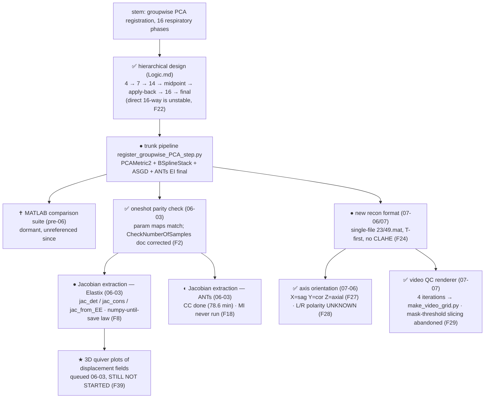

# PCA Registration — Development Tree

Regenerated by /leave. ● active · ✅ done/merged · ✝ dead/dormant · ★ current.
Retro-filled 2026-07-12.

**Stem goal:** align 16 respiratory-phase 3D ¹²⁹Xe lung volumes (gas + dissolved
channels) via hierarchical groupwise Elastix/PCAMetric2 registration, so gas-exchange
and regional-ventilation analysis (Jacobians → specific ventilation) runs on
motion-corrected data.

## Node → artifacts

| Node | Artifacts |
|------|-----------|
| B1 design | `Logic.md` (7-phase strategy + BEGINNING/END transform-propagation trick, F31) |
| B2 trunk | C1 register_groupwise_PCA_step.py (F12 F13 F41 defects live) |
| B3 MATLAB | C8 workspace/helpers/analysis/*.m (dormant) |
| B4–B5 Elastix jacobian | C2 register_elastix_oneshot.py (F5–F8 build limits) |
| B6 ANTs jacobian | C3 register_ants_oneshot.py (F15 F16 F17 F18) |
| B7 new format | C4 run_elastix_oneshot_23.py, C5 register_elastix_oneshot_gas.py, C6 register_hierarchical_gasonly.py (F24 F26 F34) |
| B8 orientation | `orientation_montage_23.py` (one-off; produced F27) |
| B9 QC | C7 make_video_grid.py (F29) |
| B10 ★ quiver | — nothing yet |

## Current position (★ B10)

Three completed runs on the new format in `workspace/outputs/registered/`:
`23_oneshot/` (2.5 min), `49_gasonly/` (2.4 min), `23_hierarchical_gasonly/`
(~10 min, 9 registrations) — all at 500 iterations, gas-focused, each with a
`gas_grid_sag_cor.mp4` QC video. Root pipeline untouched (F35).

**Next steps (per workspace handoff):**
1. Run the hierarchical script on `49.mat` so oneshot-vs-hierarchical can be
   compared on the same subject (hierarchical currently exists only for 23).
2. Decide whether to fix the dead-`cyclic` bug (F12) in the root file.
3. Quantitatively verify hierarchical-vs-oneshot instead of trusting grid videos.

**Still outstanding from the older root handoff:** the 3D quiver-plot task (F39),
the ANTs MI run (F18), and moving off 500 iterations to production
`[5000,4000,3000,2000]` (F14).

**Found during canon adoption (2026-07-12):** F41 — the `FinalGridSpacingInPhysicalUnits`
key is typo'd (`'(FinalGridSpacing…'`) and has been silently ignored by Elastix in every
run to date. Worth deciding before the next production run.
