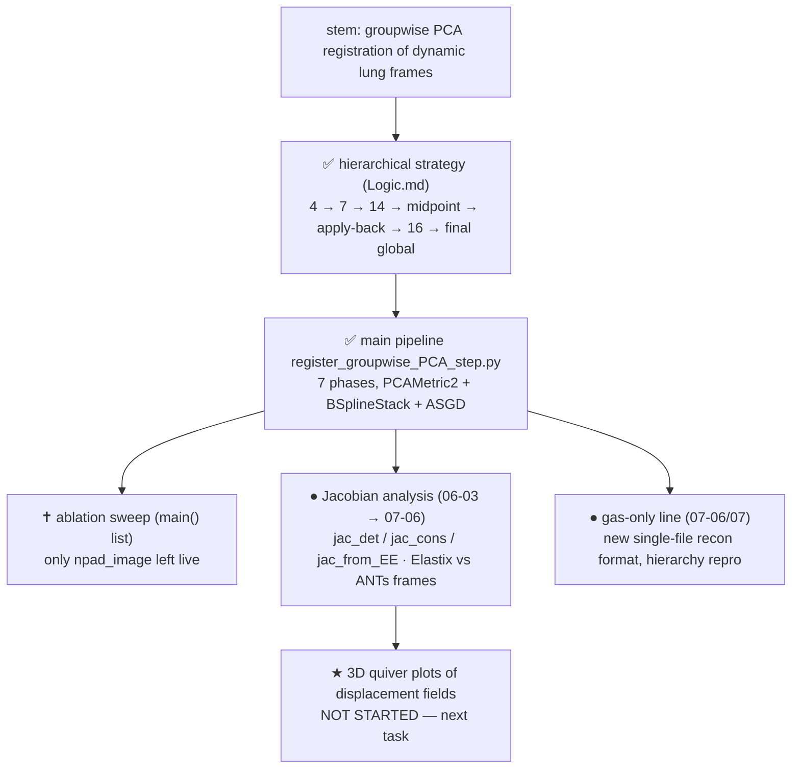

# PCA Registration — Development Tree

Regenerated by /leave. ● active · ✅ done/merged · ✝ dead · ★ current.
Retro-filled 2026-07-12.

**Stem goal:** groupwise PCA-based registration (Elastix `PCAMetric2`) of dynamic
hyperpolarized-gas lung frames, so per-voxel signal series are motion-free.

## Node → artifacts

| Node | Artifacts |
|------|-----------|
| B1 strategy | `Logic.md` (7-phase design + BEGINNING/END transform-propagation trick) |
| B2 pipeline | C1 register_groupwise_PCA_step.py (F1 F2 F3 defects live) |
| B3 ablation | C1 `main()` :1989 — list mostly commented (F13) |
| B4 jacobian | C3 register_elastix_oneshot.py, C4 register_ants_oneshot.py (F4 F5) |
| B5 gas-only | C2 register_hierarchical_gasonly.py, C5 register_elastix_oneshot_gas.py, C6 make_video_grid.py (F10) |
| B6 ★ quiver | — nothing yet |

## Current position (★ B6)

Root handoff (2026-07-06 update): Jacobian work on the oneshot scripts is done;
Elastix-vs-ANTs reference-frame distinction settled (F4), MI-over-CC settled (F5).
**Next task, not yet started: 3D quiver plots of the displacement fields.**
Workspace handoff (07-06/07): gas-only scripts + new single-file recon format
(F10) landed, runs completed.

Three known defects worth fixing before the next big run: F1 (cyclic never
applied), F2 (Elastix writes to CWD), F3 (grid-spacing key typo silently ignored).
